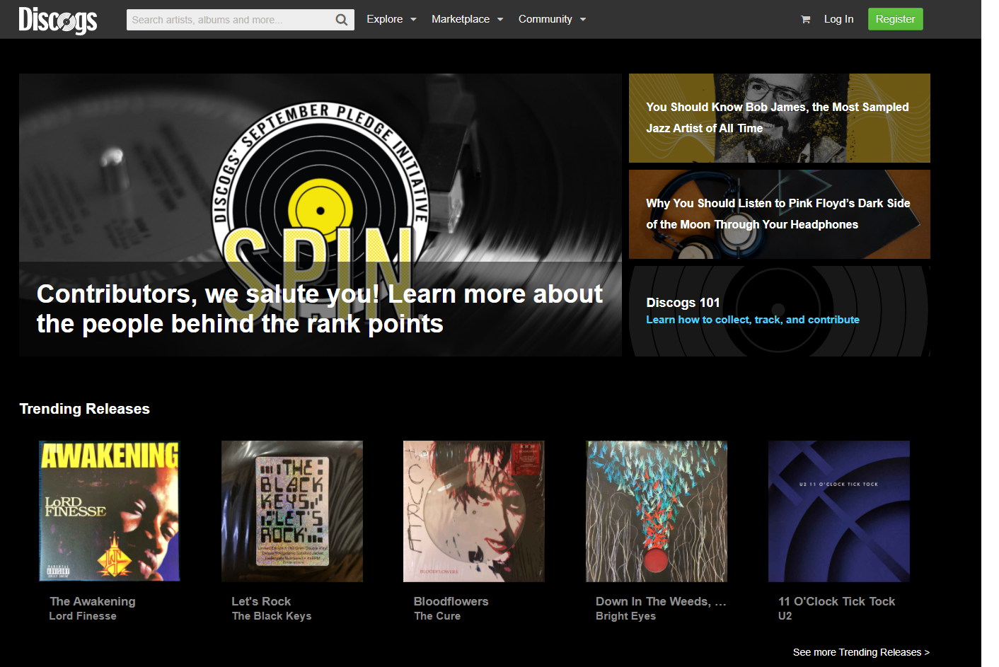
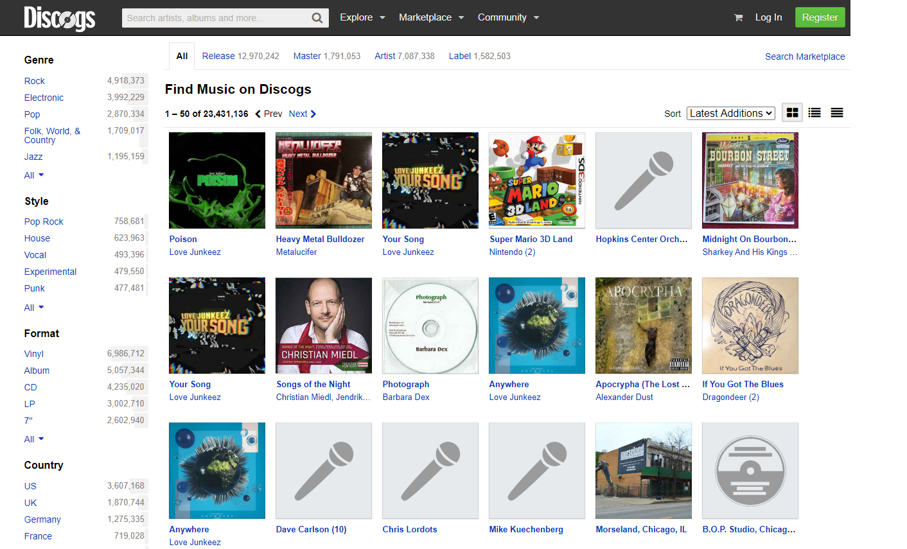
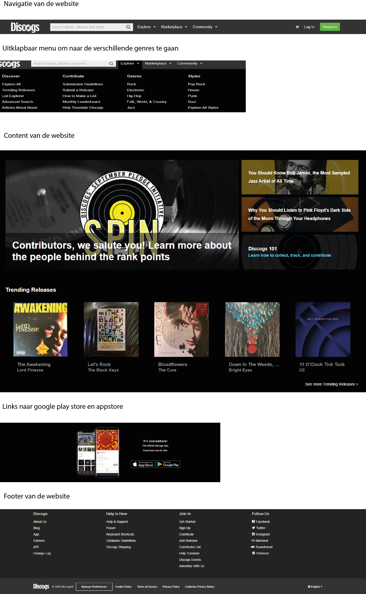

# Procesverslag
**Auteur:** -jouw naam-

Markdown cheat cheet: [Hulp bij het schrijven van Markdown](https://github.com/adam-p/markdown-here/wiki/Markdown-Cheatsheet). Nb. de standaardstructuur en de spartaanse opmaak zijn helemaal prima. Het gaat om de inhoud van je procesverslag. Besteedt de tijd voor pracht en praal aan je website.

## Bronnenlijst
1. -bron 1-
2. -bron 2-
3. -...-

## Eindgesprek (week 7/8)

-dit ging goed & dit was lastig-

**Screenshot(s):**

-screenshot(s) van je eindresultaat-

## Voortgang 3 (week 6)

-same as voortgang 1-

## Voortgang 2 (week 5)

-same as voortgang 1-

## Voortgang 1 (week 3)

### Stand van zaken

Het was even wennen met flexbox werken maar dat ging uiteindelijk wel redelijk. Verder heb ik veel met NTH of type gewerkt wat
me een beetje in de kont beet. Een animatie op de hamburger menu zetten kan niet op de manier hoe ik het heb. Dus ik heb Hulp
gekregen van een vriend van me. De code die wij geschreven hebben snap ik maar kan ik niet zomaar even namaken. Ik heb zelf
wel het alternatief gemaakt zonder animatie.

**Screenshot(s):**

-screenshot(s) van hoe ver je bent-

### Agenda voor meeting

-samen met je groepje opstellen-

### Verslag van meeting

-na afloop snel uitkomsten vastleggen-

## Intake (week 1)

**Je startniveau:** Rood

**Je focus:** Responsive

**Je opdracht:** https://www.discogs.com/

**Screenshot(s):**

**Breakdown-schets(en):**

