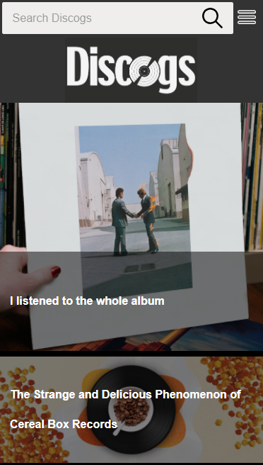
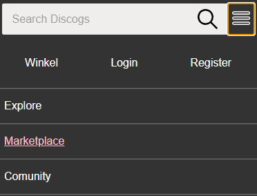
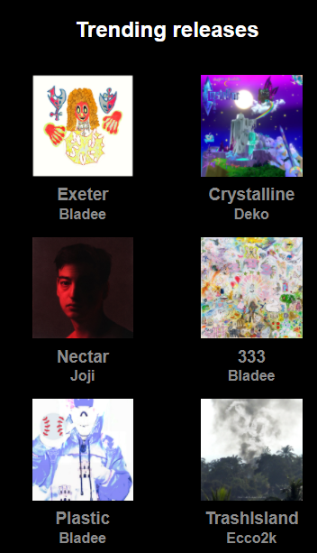
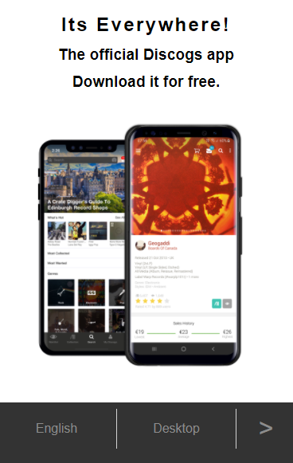
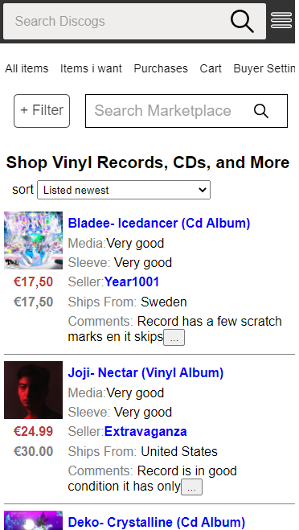
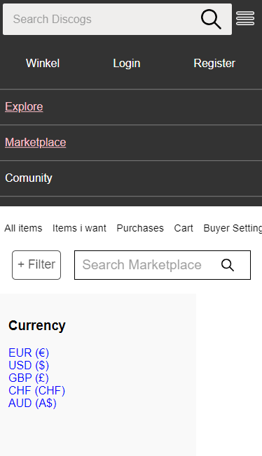
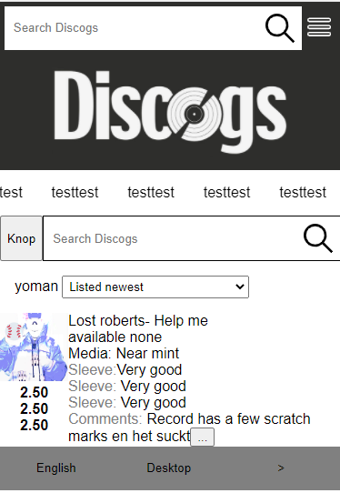
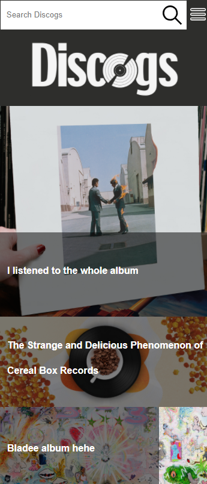
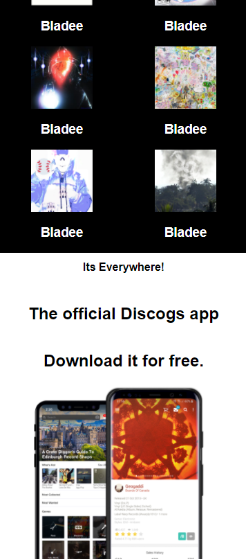
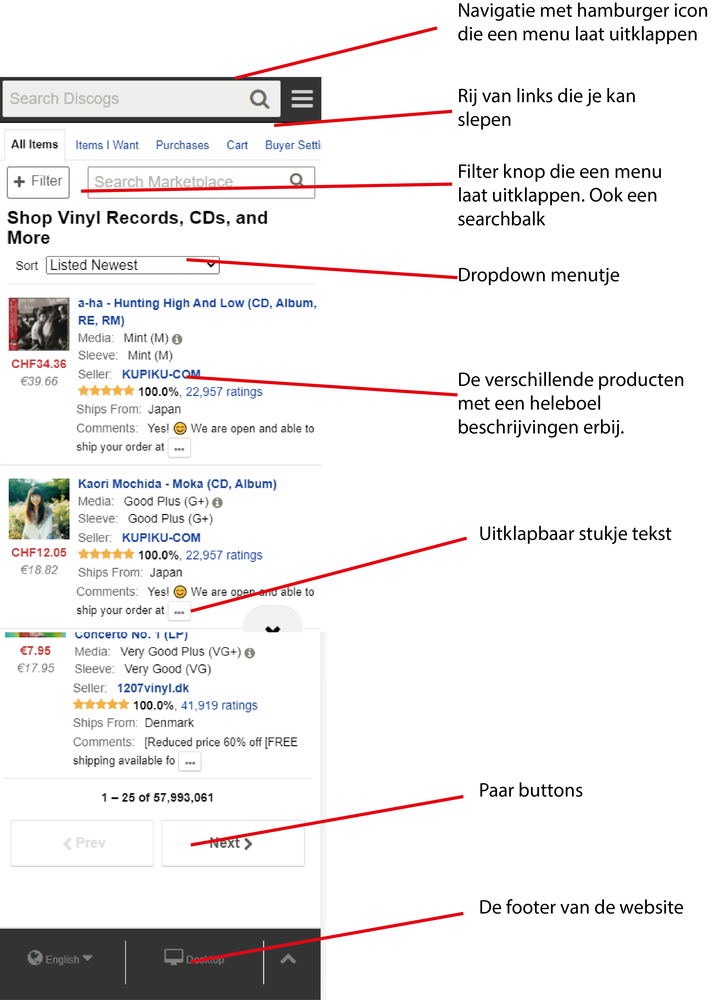

# Procesverslag
**Auteur:** Sietse Roos

## Bronnenlijst
1. https://www.w3schools.com/
2. https://thoughtbot.com/blog/css-animation-for-beginners
3. http://sinds1971.nl/
4. https://www.discogs.com/

## Eindgesprek (week 7/8)

 De laatste week ging veruit het beste. Het hele blok lang was ik voor mijn gevoel
 aan het inkomen. De hele tijd dingetjes vergeten en vastlopen maar in deze Week
 heb ik heel veel progressie gemaakt. Ik was niet de hele tijd alles aan het
 vergeten en kon gewoon door coderen. Ik ben wat animaties aan het toevoegen
 om de website wat leuker te maken en ook states.

**Screenshot(s):**

## Voortgang 3 (week 6)

  Surface plane loopt mij wel goed af voor nu. Ik moest even wat meer inkomen in
  coderen om responsive te doen. Ik heb veel gewerkt aan mijn tweede pagina. De
  producten op de juiste plek zetten is wel lastig maar ik maak veel progressie.

## Voortgang 2 (week 5)

Het werken naar responsive vond ik vervelend gaan met hoe ik mijn html gedaan had. Ik ga hier later even naar kijken voor mezelf.
Voor nu ben ik naar surface plane gedaan. Verder ging het goed om mijn extra pagina te maken. Javascript gebruiken was weer even wennen
maar verliep mij goed af. Ik moet mijn 2e pagina nog even vormgeven en dan kan ik beginnen aan mijn laatste pagina.

## Voortgang 1 (week 3)

### Stand van zaken

Het was even wennen met flexbox werken maar dat ging uiteindelijk wel redelijk. Verder heb ik veel met NTH of type gewerkt wat
me een beetje in de kont beet. Een animatie op de hamburger menu zetten kan niet op de manier hoe ik het heb. Dus ik heb Hulp
gekregen van een vriend van me. De code die wij geschreven hebben snap ik maar kan ik niet zomaar even namaken. Ik heb zelf
wel het alternatief gemaakt zonder animatie.

**Screenshot(s):**

### Agenda voor meeting

week 3: Ik had vragen over de netheid van mijn code. Ik merkte dat ik veel divs
aan het gebruiken was en dat dat niet de bedoeling was. Ik heb wat handige tips
gekregen om dat te verminderen en heb dat ook gedaan. Verder had ik niet heel
veel vragen en ging ik meeluisteren met andere studenten waar ik ook veel van
heb geleerd

week 2: Deze week had ik vragen over flexbox en mijn hamburger menu. flexbox
vind ik nog soms verwarrend om te gebruiken maar ik denk dat ik nu wel weer
verder kan. Ik heb handige pointers gehad over wanneer je het wilt gebruiken.

Verder had ik ook nog vragen over mijn hamburger menu. Het uitklappen werkt
nogsteeds niet helemaal goed. Het is mij gelukt met hulp van een vriend in
javascript maar hier leer ik niet genoeg van. Dus ik ga het zelf opnieuw
maken in css.

Week 1: Geen vragen gehad deze week.

### Verslag van meeting

De eerste week was voor mij nog wel rustig. Ik moest even inkomen weer met coderen
maar het liep mij wel goed af. Ik had niet heel veel vragen dus ik was aan het
meeluisteren met andere studenten.

## Intake (week 1)

**Je startniveau:** Rood

**Je focus:** Surface Plane

**Je opdracht:** https://www.discogs.com/

**Screenshot(s):**

**Breakdown-schets(en):**

